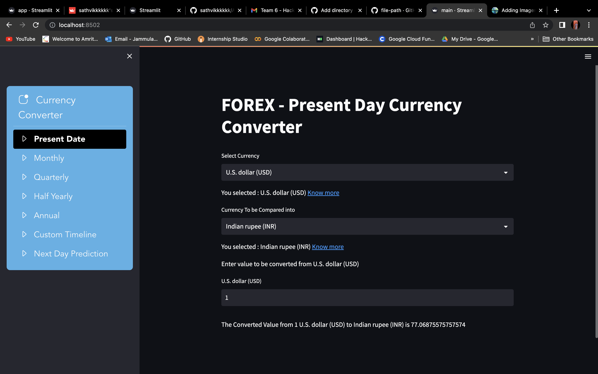
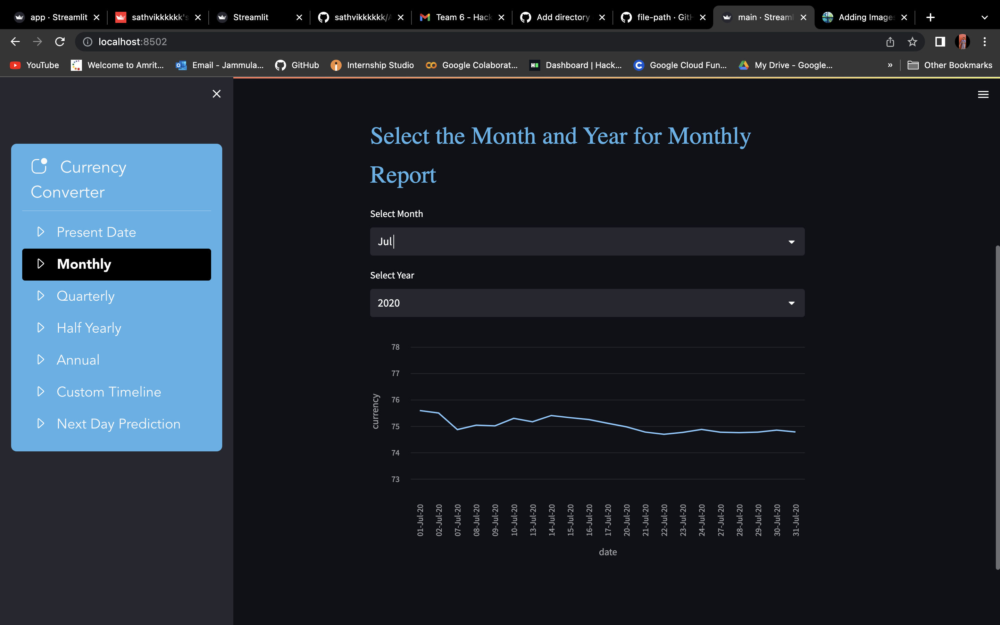
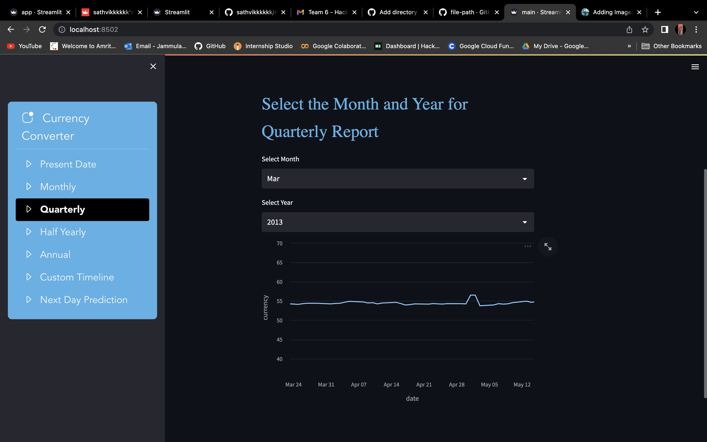
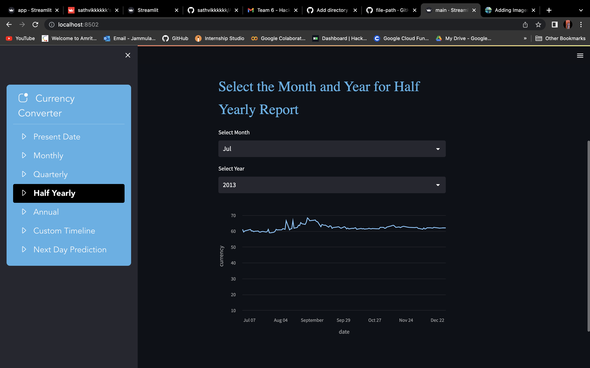
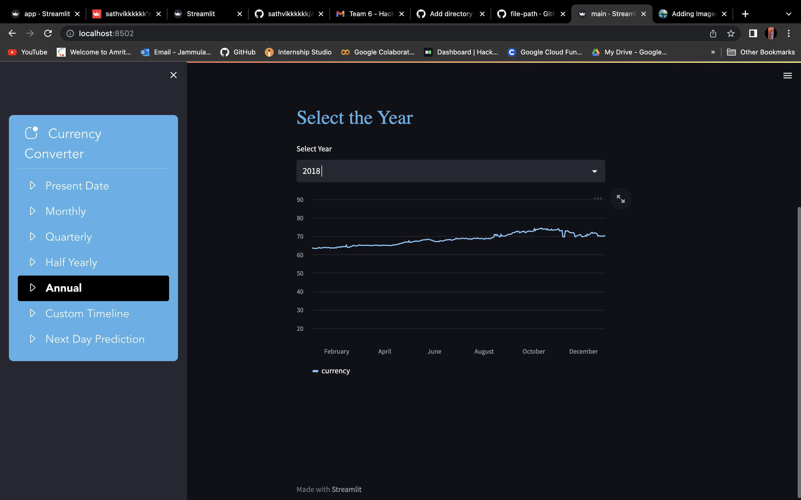
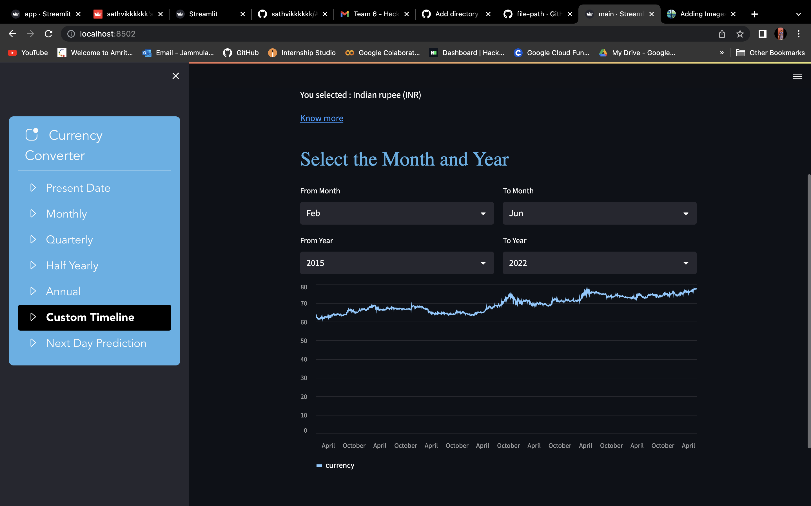
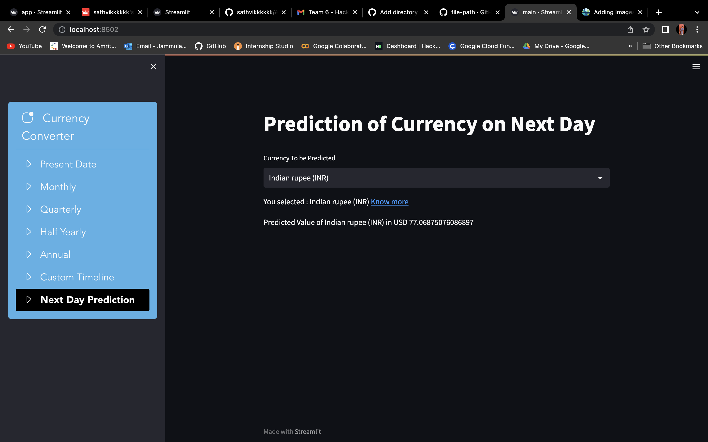

# Amrita-Team6-CurrencyConverter-NTRS
Submission of Codes for NTRS Hackathon by Team 6 from Amrita Vishwa Vidyapeetham by Sathvik, Kavya, Tejeswini, Lakshmi and Lakshmi Warrier.

Used for Currency Conversion, getting maximum and minimum values of currency at a particular time period


## Description

Used Python and Streamlit to deploy the local app of Currency Converter

## Getting Started
## Features

### Get conversion of any currency to any other currency
* The user has to select the required two required currencies and the amount to be converted
* The graph is displayed with the selected currency in terms of USD on the y-axis and the dates on the x-axis

### Get monthly analysis of a selected currency
* The user has to select the required currency and the required month to obtain the monthly report
* The graph is displayed with the selected currency in terms of USD on the y-axis and the dates on the x-axis

### Get quarterly analysis of a selected currency
* The user has to select the required currency and the required month to obtain the report three months from then
* The graph is displayed with the selected currency in terms of USD on the y-axis and the dates on the x-axis

### Get half-yearly analysis of a selected currency
* The user has to select the required currency and the required month to obtain the report six months from then
* The graph is displayed with the selected currency in terms of USD on the y-axis and the dates on the x-axis

### Get annual analysis of a selected currency
* The user has to select the required currency and the required month to obtain the report one year months from then
* The graph is displayed with the selected currency in terms of USD on the y-axis and the dates on the x-axis

### Get the prediction of the next day exchange rate of a selected currency
* The user has to select the required currency
* The predicted value of the currency is displayed 
* The prediction is done using ARIMA model

## Assumptions
 
 * The null cells in the dataset are populated with the nearest non null values
 * Annual report is generated only for a single complete year (Jan to Dec of a given year)
### Dependencies

* Python
* Streamlit
* streamlit 
* pandas 
* os 
* itertools 
* datetime 
* numpy 
* statsmodels
* machine learning libraries

### Installing

* Download/Clone the repo by using 
```
git clone https://github.com/sathvikkkkkk/Amrita-Team6-CurrencyConverter-NTRS
```
* Change the terminal directory to current folder

### Executing program

* Make sure to check all the requirements from the 'requirements.txt'
* Install by using
```
pip install requirements.txt 
```
* First, open terminal and change directory to current project folder
```
cd Amrita-Team6-CurrencyConverter-NTRS
```
* Run the app.py using streamlit
```
streamlit run app.py
```
* Will give an output as following:
```

  You can now view your Streamlit app in your browser.

  Local URL: http://localhost:8501
  Network URL: http://172.31.27.184:8501

  For better performance, install the Watchdog module:

```
* Click on the Local / Global URL to start using the Web App
## Website Screenshots
* Gives Present Day Forex Exchange Rates

* Gives Monthly Report

* Gives Quarterly Report

* Gives Half Yearly Report

* Gives Annual Report

* Gives Custom Time Period Report

* Gives Machine Learning Prediction of FOREX of Next Day



## Contributors/Authors
- [Jammula Durga Bala Sathvik](https://github.com/sathvikkkkkk/)
- Kavya Duvvuri
- Kota Venkata Leela Tejaswini
- Lakshmi V. B.
- Lakshmi Warrier